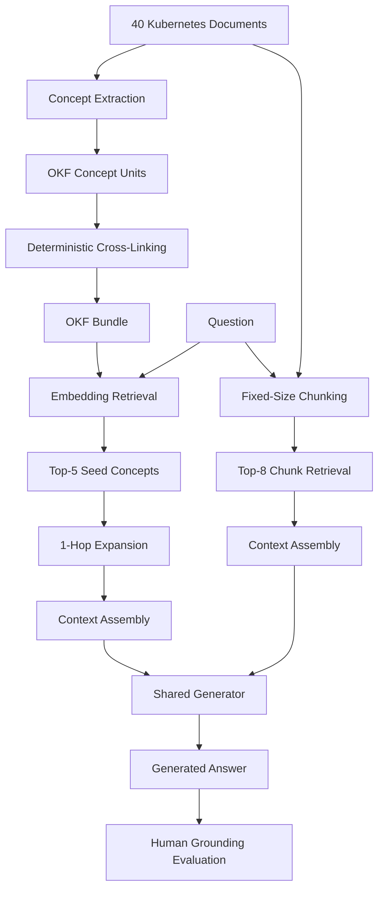

```markdown
# OKF-RAG

## Mitigating Hallucination in Retrieval-Augmented Generation using Curated Open Knowledge Format Bundles

> A controlled investigation into whether the structure of retrieved knowledge matters more than retrieval itself.


---

## Abstract

Retrieval-Augmented Generation (RAG) is widely used to reduce hallucination in large language models, but it remains unclear whether the form in which the retrieval corpus is stored matters as much as retrieval itself.

This project investigates a specific hypothesis:

> **Does replacing arbitrary fixed-size chunks with small, self-contained, cross-linked concept units reduce hallucination when every other experimental variable is held constant?**

To test this, two controlled retrieval arms were evaluated over an identical Kubernetes documentation corpus:

- **Conventional fixed-size Chunk-RAG**
- **OKF-RAG using curated Open Knowledge Format concept units**

The study used two independent experimental configurations, human-authored questions, a shared context-token budget, controlled generation settings, and human-assigned grounding labels as the primary evaluation metric.

The result was a controlled null for hallucination reduction: neither configuration showed a statistically detectable reduction in hallucination, and the direction of the point estimate reversed between configurations.

However, one result replicated across both configurations:

> **OKF-RAG achieved comparable answer quality while using fewer retrieval context tokens.**

A direct audit of the knowledge graph further identified a likely mechanical explanation for the null result: alias-derived links, which formed the majority of the graph, were substantially less precise than title-derived links.

The study therefore does not establish that curation reduces hallucination. Instead, it provides a controlled evaluation showing that **knowledge curation alone was insufficient under the tested linking mechanism, while offering a measurable context-efficiency advantage.**

---

# Table of Contents

- [Research Question](#-research-question)
- [Core Idea](#-core-idea)
- [System Architecture](#-system-architecture)
- [Chunk-RAG vs OKF-RAG](#-chunk-rag-vs-okf-rag)
- [Dataset](#-dataset)
- [Question Set](#-question-set)
- [Experimental Configurations](#-experimental-configurations)
- [OKF Bundle Construction](#-okf-bundle-construction)
- [Retrieval Configuration](#-retrieval-configuration)
- [Evaluation Protocol](#-evaluation-protocol)
- [Results](#-results)
- [Hallucination Results](#-hallucination-results)
- [Context Efficiency](#-context-efficiency)
- [Link Precision Analysis](#-link-precision-analysis)
- [Key Findings](#-key-findings)
- [Project Structure](#-project-structure)
- [Running the Experiment](#-running-the-experiment)
- [Technology Stack](#-technology-stack)
- [Reproducibility](#-reproducibility)
- [Limitations](#-limitations)
- [Future Work](#-future-work)
- [Research Contribution](#-research-contribution)
- [Research Artefacts](#-research-artefacts)
- [Citation](#-citation)
- [Author](#-author)

---

# 🔬 Research Question

Traditional RAG systems commonly split documents into fixed-size chunks before embedding and retrieval.

This introduces arbitrary boundaries:

```text
Document
│
├── Chunk 1
├── Chunk 2
├── Chunk 3
└── Chunk 4
```

A relevant definition may be split across chunks, while unrelated neighbouring information may be retrieved together.

OKF-RAG investigates whether a more structured representation can improve grounding:

```text
Document
│
├── Concept A
│     ├── Related Concept B
│     └── Related Concept C
│
├── Concept B
│     └── Related Concept D
│
└── Concept C
```

The central hypothesis was:

```text
Curated concepts
       +
Explicit relationships
       ↓
Better retrieval context
       ↓
Better grounding
       ↓
Lower hallucination
```

Rather than assuming the hypothesis is true, this project isolates and tests it experimentally.

---

# 🧠 Core Idea

The project compares two retrieval substrates while keeping the rest of the pipeline controlled.

## Conventional Chunk-RAG

```text
Raw Documents
      ↓
512-token chunking
      ↓
64-token overlap
      ↓
Embedding
      ↓
Top-8 retrieval
      ↓
1,800-token context
      ↓
LLM
```

## OKF-RAG

```text
Raw Documents
      ↓
Concept extraction
      ↓
Self-contained OKF concepts
      ↓
Deterministic cross-linking
      ↓
Embedding of title + description
      ↓
Top-5 seed concepts
      ↓
1-hop expansion
      ↓
Maximum 4 neighbours
      ↓
1,800-token context
      ↓
LLM
```

The experimental variable is the **retrieval substrate**.

---

# 🏗️ System Architecture



---

# ⚔️ Chunk-RAG vs OKF-RAG

| Dimension | Chunk-RAG | OKF-RAG |
|---|---|---|
| Knowledge unit | Fixed-size passage | Self-contained concept |
| Segmentation | 512 tokens | LLM-extracted concepts |
| Chunk overlap | 64 tokens | Not applicable |
| Retrieval seeds | Top-8 passages | Top-5 concept units |
| Relationship model | None | Explicit cross-links |
| Expansion | None | 1-hop |
| Maximum neighbours | — | 4 |
| Embedding model | all-MiniLM-L6-v2 | all-MiniLM-L6-v2 |
| Embedding field | Chunk text | Title + description |
| Context budget | 1,800 tokens | 1,800 tokens |
| Generator | Same within configuration | Same within configuration |
| Evaluation | Human grounding | Human grounding |

The objective was to change the retrieval substrate rather than simultaneously changing the generator, corpus, question set or context budget.

---

# 📚 Dataset

The experiment uses **40 Markdown documents from official Kubernetes documentation**.

### Corpus statistics

```text
Documents       : 40
Total words     : 30,102
Mean words/doc  : 752.5
```

The corpus spans areas including:

- Kubernetes architecture
- Cluster administration
- Containers
- Cluster extensions
- Object model
- Scheduling and eviction
- Security
- Services and networking
- Workloads

The corpus was selected because Kubernetes documentation contains substantial cross-reference structure, making it a suitable test environment for a retrieval substrate based on explicit concept relationships.

Only 17 of the 40 documents were used as gold sources by questions in the question pool. The remaining documents acted as distractors in retrieval.

---

# ❓ Question Set

The project contains:

```text
122 human-authored questions
```

Each question was created against the corpus with:

- Gold answer
- Gold source document(s)
- Answerability information
- Evaluation metadata

The two experimental configurations used:

```text
Configuration 1 → 60 paired questions
Configuration 2 → 65 paired questions
```

The evaluation also includes unanswerable questions to examine whether the systems abstain when sufficient evidence is unavailable.

---

# 🧩 OKF Bundle Construction

The OKF bundle transforms raw documentation into concept-level units.

Each concept contains structured information such as:

```text
Concept
├── Title
├── Description
├── Body
├── Aliases
├── Provenance
└── Links
```

The bundle-building process consists of:

```text
Raw Kubernetes Documentation
            ↓
      Concept Extraction
            ↓
   Self-contained concepts
            ↓
  Deterministic cross-linking
            ↓
      OKF Knowledge Bundle
```

The concept extraction stage uses a language model, while the cross-linking procedure is deterministic.

---

# 🔗 Cross-Linking

The retrieval graph connects concepts using title and alias matching.

This enables the retrieval pipeline to perform:

```text
Seed Concept
     ↓
Related Concept
     ↓
Related Concept
```

The purpose is to recover information that may be separated by document or chunk boundaries.

However, the later link-quality audit revealed that the quality of these links is critical to whether graph expansion is useful.

---

# 🧪 Experimental Configurations

The experiment was performed under two configurations.

## Configuration 1

```text
Generator:
Llama 3.1 8B

Bundle extractor:
Llama 3.1 8B

Bundle:
371 concepts
1,103 links

Questions:
60

Grounding judge:
Same generator
```

Purpose:

> Initial controlled comparison.

---

## Configuration 2

```text
Generator:
NVIDIA Nemotron-3.5-Lightning-30B-A3B

Bundle extractor:
NVIDIA Nemotron-3.5-Lightning-30B-A3B

Bundle:
358 concepts
1,031 links

Questions:
65

Grounding judge:
Qwen2.5-7B-Instruct
```

Purpose:

> Robustness replication using a stronger generator, independently extracted bundle and a different-family judge.

This second configuration helps test whether the observed outcome is an artefact of:

- A weak generator
- One particular bundle extraction
- Self-judging
- A particular model family

---

# ⚙️ Retrieval Configuration

The context budget was fixed at:

```text
1,800 tokens
```

## Chunk-RAG

```yaml
chunk_size_tokens: 512
chunk_overlap_tokens: 64
top_k: 8
```

## OKF-RAG

```yaml
top_k: 5
hop_expansion: 1
max_expanded: 4
embed_field: title_description
```

## Shared Settings

```yaml
temperature: 0.0
seed: 42
```

The embedding model used by both retrieval arms was:

```text
all-MiniLM-L6-v2
```

---

# 📏 Evaluation Protocol

The primary evaluation metric was **human grounding**.

Every answer was assigned exactly one label.

| Label | Definition |
|---|---|
| Supported | Every factual claim is stated in or directly entailed by the retrieved context |
| Unsupported | At least one claim is not supported by the retrieved context |
| Contradicted | The answer conflicts with the retrieved context |
| Abstained | The model declines because the evidence is insufficient |

## Hallucination Definition

```text
Hallucination
=
Unsupported + Contradicted
```

The evaluation measures **grounding**, not general real-world correctness.

For example:

> If an answer is factually true about Kubernetes but the retrieved context does not contain or entail that information, it is labelled unsupported.

---

# 📊 Metrics

The experiment evaluates the following:

### Primary Metric

- Human-labelled hallucination rate

### Secondary Metrics

- Token-level F1
- Exact match
- Retrieval recall
- Citation validity
- Abstention rate
- Context tokens consumed
- Number of units retrieved

### Statistical Tests

```text
Paired Bootstrap
+
McNemar's Exact Test
```

The statistical comparison is paired by question.

---

# 💥 Results

## Hallucination Results

The main result is deliberately not presented as a success story.

### Configuration 1

```text
Chunk-RAG hallucination : 0.0333
OKF-RAG hallucination   : 0.0833

Δ (OKF − Chunk)         : +0.0500

Bootstrap p             : 0.3056
McNemar exact p         : 0.4531
```

OKF-RAG hallucinated on:

```text
5 / 60 questions
```

while Chunk-RAG hallucinated on:

```text
2 / 60 questions
```

---

### Configuration 2

```text
Chunk-RAG hallucination : 0.0308
OKF-RAG hallucination   : 0.0154

Δ (OKF − Chunk)         : -0.0154

Bootstrap p             : 0.6042
McNemar exact p         : 1.0000
```

OKF-RAG hallucinated on:

```text
1 / 65 questions
```

while Chunk-RAG hallucinated on:

```text
2 / 65 questions
```

---

# 🚨 The Important Result

The direction of the effect **reversed between configurations**.

```text
Configuration 1
OKF → higher observed hallucination

Configuration 2
OKF → lower observed hallucination
```

Neither difference was statistically significant.

Therefore:

> **The experiment does not detect a hallucination reduction from curation alone.**

This is the central result of the study.

The null result is not treated as a failure of the experiment. It is the measured outcome of a controlled test of the hypothesis.

---

# ⚡ Context Efficiency

This is where OKF-RAG produced a consistent effect.

## Configuration 1

```text
Chunk-RAG : 1,615.4 tokens
OKF-RAG   : 1,162.6 tokens

Reduction : 28.0%
```

## Configuration 2

```text
Chunk-RAG : 1,644.5 tokens
OKF-RAG   : 1,472.8 tokens

Reduction : 10.4%
```

The direction of the effect replicated in both configurations.

```text
C1 → 28.0% fewer tokens
C2 → 10.4% fewer tokens
```

This occurred while answer quality remained statistically indistinguishable between the arms.

---

# 🧠 Why Was Context Smaller?

OKF-RAG retrieves more individual knowledge units.

### Configuration 1

```text
Chunk-RAG → 3.08 units/question
OKF-RAG   → 8.83 units/question
```

### Configuration 2

```text
Chunk-RAG → 3.12 units/question
OKF-RAG   → 8.34 units/question
```

But each OKF unit is more targeted.

Instead of retrieving a large fixed-size passage containing surrounding material, the system can assemble a context from smaller concept-level units.

Therefore:

```text
More targeted units
        ↓
Less surrounding text
        ↓
Lower context consumption
```

The magnitude of the saving changed between configurations because the concept bodies themselves differed in size.

---

# 🔗 Link Precision Analysis

The experiment did not stop at:

> "OKF didn't improve hallucination."

It asked:

> **Why?**

A manual audit was performed on 100 randomly sampled links from the Configuration 1 graph.

The results were:

| Link Type | Correct | Borderline | Spurious | Strict Precision | Lenient Precision |
|---|---:|---:|---:|---:|---:|
| Title | 21 | 5 | 1 | 77.8% | 96.3% |
| Alias | 23 | 30 | 20 | 31.5% | 72.6% |
| All Links | 44 | 35 | 21 | 44.0% | 79.0% |

This is one of the most important findings of the project.

---

# 🧨 The Graph Problem

The majority of links were alias-derived.

### Configuration 1

```text
Total links          : 1,103
Alias-derived links  : 768
```

### Configuration 2

```text
Total links          : 1,031
Alias-derived links  : 806
```

But alias-derived links had only:

```text
31.5% strict precision
```

compared with:

```text
77.8% strict precision
```

for title-derived links.

In other words:

```text
Alias matching
      ↓
Dense graph
      ↓
Low precision
      ↓
Potentially irrelevant neighbours
      ↓
Weak graph expansion
```

This provides a concrete mechanical explanation for why the expected grounding benefit did not appear.

---

# 🔬 Title-Only Variant

A title-only variant was also constructed using the same concept set.

It contained:

```text
371 concepts
387 links
```

compared with:

```text
1,103 links
```

in the alias-enabled graph.

Therefore:

```text
Alias-enabled graph
→ Dense
→ Lower precision

Title-only graph
→ Sparse
→ Much higher precision
```

The title-only variant was not carried through a full generation experiment, making it one of the highest-value directions for future work.

---

# 📌 Key Findings

## 1. Hallucination reduction was not detected

Neither configuration produced a statistically significant hallucination reduction.

```text
C1 McNemar p = 0.4531
C2 McNemar p = 1.0000
```

---

## 2. The effect direction was unstable

```text
C1 → OKF worse
C2 → OKF better
```

The sign reversal is consistent with variation around zero rather than a stable treatment effect.

---

## 3. Context efficiency improved consistently

```text
C1 → 28.0% reduction
C2 → 10.4% reduction
```

This was the most consistent measurable advantage of the curated substrate.

---

## 4. Link quality appears to be the bottleneck

```text
Title-link strict precision → 77.8%
Alias-link strict precision → 31.5%
```

Alias links dominated the graph.

---

## 5. The hypothesis was not conclusively disproved

The experiment shows that:

> **The tested OKF construction did not produce a measurable hallucination reduction.**

It does not establish that every possible form of OKF curation cannot reduce hallucination.

The tested linking mechanism may have prevented the intended benefit from reaching the generator.

---

# 📊 Main Results Table

| Metric | C1 Chunk | C1 OKF | C2 Chunk | C2 OKF |
|---|---:|---:|---:|---:|
| Paired questions | 60 | 60 | 65 | 65 |
| Hallucination | 0.0333 | 0.0833 | 0.0308 | 0.0154 |
| Hallucination Δ | — | +0.0500 | — | -0.0154 |
| F1 | 0.3151 | 0.2869 | 0.2312 | 0.2418 |
| Exact Match | 0.0000 | 0.0167 | 0.0000 | 0.0000 |
| Retrieval Recall | 0.8558 | 0.7981 | 0.8636 | 0.9091 |
| Citation Validity | 1.0000 | 0.9136 | 1.0000 | 1.0000 |
| Abstained | 0.1500 | 0.1667 | 0.2769 | 0.2615 |
| Context Tokens | 1615.4 | 1162.6 | 1644.5 | 1472.8 |
| Units Retrieved | 3.08 | 8.83 | 3.12 | 8.34 |

---

# 🗂️ Project Structure

```text
okf-rag-v2/
│
├── config.yaml
├── config_v2_kaggle.yaml
│
├── data/
│   ├── raw/
│   │   └── Kubernetes documentation
│   │
│   └── okf_bundle/
│       └── curated concept units
│
├── questions/
│   └── questions.csv
│
├── src/
│   ├── config.py
│   ├── llm.py
│   ├── chunk_rag.py
│   ├── okf_rag.py
│   ├── build_bundle.py
│   ├── run_experiment.py
│   ├── evaluate.py
│   └── analyze.py
│
├── scripts/
│   └── merge_human_labels.py
│
├── results/
│   ├── v1_reference/
│   └── v2_kaggle/
│
├── results/v2_active_qids_v2.txt
│
├── README.md
│
└── requirements.txt
```

The source tree intentionally separates:

```text
Input data
    ↓
Knowledge construction
    ↓
Retrieval
    ↓
Generation
    ↓
Evaluation
    ↓
Analysis
```

This makes the experimental pipeline easier to inspect and reproduce.

---

# 🚀 Running the Experiment

## 1. Install Dependencies

```bash
pip install -r requirements.txt
```

---

## 2. Build the OKF Bundle

```bash
python -m src.build_bundle
```

This converts the raw corpus into concept-level OKF units and constructs the cross-link graph.

---

## 3. Run the Experiment

For the active question set:

```bash
python -m src.run_experiment --qids-file results/v2_active_qids_v2.txt
```

The pipeline generates responses for both:

```text
Chunk-RAG
OKF-RAG
```

---

## 4. Evaluate Generated Answers

```bash
python -m src.evaluate --input raw_okf_rag_v2_kaggle_full.csv
```

---

## 5. Merge Human Labels

```bash
python scripts/merge_human_labels.py \
    --sheet v2_kaggle/human_labels_okf_rag_v2_kaggle_full.csv \
    --scored v2_kaggle/scored_okf_rag_v2_kaggle_full.csv
```

---

## 6. Generate Analysis

```bash
python -m src.analyze
```

This produces the statistical tables, comparisons and figures used to interpret the experiment.

---

# 🛠️ Technology Stack

### Language

```text
Python 3.11
```

### Retrieval

```text
Sentence Transformers
all-MiniLM-L6-v2
```

### LLM Inference

```text
Llama 3.1 8B
NVIDIA Nemotron-3.5-Lightning-30B-A3B
Qwen2.5-7B-Instruct
```

### Data & Analysis

```text
Pandas
NumPy
Matplotlib
CSV
```

### Evaluation

```text
Human grounding labels
Paired bootstrap
McNemar's exact test
```

### Knowledge Representation

```text
Open Knowledge Format
Concept units
Cross-link graph
```

---

# 🔁 Reproducibility

The experiment was designed around controlled comparison.

The core principle was:

> **Change one thing, measure one thing.**

Within each configuration:

```text
Same corpus
Same questions
Same context budget
Same embedding model
Same generator
Same temperature
Same seed
Same evaluation protocol
```

The retrieval substrate is the key difference:

```text
Fixed-size chunks
        VS
Curated OKF concepts + graph expansion
```

The second configuration then changes generator strength, bundle provenance and judge family to test robustness.

The generation and evaluation pipeline is also designed to be resumable, allowing interrupted runs to continue without unnecessarily repeating completed rows.

---

# ⚠️ Limitations

This study has several important limitations.

## 1. Small Corpus

The experiment uses 40 Kubernetes documents.

The result may not generalize to:

- Other technical domains
- Larger corpora
- Open-domain QA
- Long-form generation

---

## 2. Question Set Size

The configurations use 60 and 65 paired questions.

A larger question set would provide greater statistical power.

---

## 3. Link Construction

The graph is strongly dependent on title and alias matching.

The alias-based links showed substantially lower precision.

---

## 4. Title-Only Variant Was Not Fully Evaluated

Although a title-only bundle was constructed, it was not taken through a complete generation experiment.

This prevents a direct causal comparison between:

```text
Alias-enabled OKF
vs
Title-only OKF
```

---

## 5. Judge Dependence

LLM judges were treated as screening instruments rather than the headline evaluation.

The reported hallucination metric is based on human grounding labels.

An earlier cross-judge check found:

```text
Agreement = 90.0%
Cohen's κ = 0.518
```

indicating meaningful judge-dependent variance.

---

## 6. Context-Efficiency Magnitude Varied

The context reduction was:

```text
28.0% in Configuration 1
10.4% in Configuration 2
```

The direction of the effect replicated, but the magnitude did not.

---

# 🔮 Future Work

The most important next experiment is not simply:

> "Run OKF-RAG again."

It is:

> **Improve the graph construction mechanism.**

---

## Priority 1 — High-Precision Linking

Replace or constrain generic alias matching.

Possible directions:

```text
Title-only linking
        ↓
Entity-aware linking
        ↓
Semantic verification
        ↓
Hybrid deterministic + semantic links
```

---

## Priority 2 — Evaluate the Title-Only Bundle

The existing title-only variant contains:

```text
371 concepts
387 links
```

and showed substantially better link precision.

A complete generation/evaluation run would directly test whether:

> **Fewer but more reliable links outperform dense noisy expansion.**

---

## Priority 3 — Larger Evaluation Set

Increase:

```text
Questions
Corpus size
Domains
```

to determine whether the context-efficiency effect generalizes.

---

## Priority 4 — Multi-Hop Evaluation

The curated system is specifically designed to exploit relationships between concepts.

Future experiments should therefore stress-test:

```text
1-hop questions
2-hop questions
Multi-document reasoning
Multi-concept reasoning
```

rather than relying primarily on direct retrieval questions.

---

## Priority 5 — Better Graph Quality Metrics

Instead of evaluating the graph only after generation, measure:

```text
Link precision
Link recall
Graph density
Neighbour relevance
Expansion usefulness
```

before evaluating answer generation.

---

# 🧪 The Research Takeaway

The most important conclusion is not:

> "OKF-RAG works."

And it is not:

> "OKF-RAG doesn't work."

The defensible conclusion is more precise:

> **Under the tested construction and linking mechanism, replacing fixed-size chunks with curated OKF concepts did not produce a statistically detectable reduction in hallucination. However, it consistently reduced retrieval context consumption, while a direct graph audit revealed that low-precision alias links likely weakened the intended benefit of graph expansion.**

That distinction matters.

The experiment separates:

```text
Concept granularity
        ≠
Graph quality
        ≠
Retrieval efficiency
        ≠
Hallucination reduction
```

Instead of treating "structured retrieval" as one monolithic idea, this work identifies **which component appears to be limiting the system.**

---

# 🏆 Research Contribution

This project contributes:

1. **A controlled comparison of OKF-RAG and conventional chunk-RAG**
2. **Isolation of the retrieval substrate as the main experimental variable**
3. **Two independent experimental configurations**
4. **Human-labelled grounding evaluation**
5. **Paired statistical testing**
6. **Context-efficiency analysis**
7. **Direct cross-link quality auditing**
8. **A concrete diagnosis of alias-derived graph noise**
9. **A reproducible experimental pipeline**
10. **An honest controlled null result rather than an overstated positive claim**

---

# 📦 Research Artefacts

This repository accompanies the research paper and technical seminar material.

The project contains:

```text
Research Paper
Technical Seminar Report
Technical Seminar Presentation
Experimental Code
OKF Bundles
Question Dataset
Evaluation Results
Analysis Scripts
Configuration Files
```

The repository is intended to preserve not only the final result, but also the experimental artefacts needed to understand how that result was obtained.

---

# 📖 Research Paper

### Title

**Does Open Knowledge Format Curation Reduce Hallucination in Retrieval-Augmented Generation? A Controlled Study**

### Author

**Daksh Mahera**

### Keywords

```text
Retrieval-Augmented Generation
Hallucination
Knowledge Curation
Large Language Models
Question Answering
Open Knowledge Format
Information Retrieval
Knowledge Graphs
```

---

# 🎓 Academic Context

This work was developed as a research and experimental study in the field of:

- Retrieval-Augmented Generation
- Large Language Models
- Knowledge Representation
- Information Retrieval
- Hallucination Evaluation
- Knowledge Graphs
- Experimental NLP

The project focuses on **controlled experimentation rather than simply building another RAG application**.

---

# 💡 Why This Experiment Matters

A common pattern in AI research is:

```text
New architecture
      ↓
Better benchmark score
      ↓
Conclusion: architecture works
```

This project takes a different approach:

```text
Hypothesis
      ↓
Controlled experiment
      ↓
Repeated configuration
      ↓
Human evaluation
      ↓
Statistical testing
      ↓
Mechanism audit
      ↓
Measured conclusion
```

The experiment therefore asks not only:

> **Did it work?**

but also:

> **Why did it work or fail to work?**

That distinction is central to the project.

---

# 🧠 Final Conclusion

The controlled experiments did **not** find evidence that OKF curation alone reduces hallucination relative to conventional fixed-size chunk retrieval.

The hallucination effect was:

```text
Configuration 1 → +0.0500
Configuration 2 → -0.0154
```

and the direction reversed across configurations.

However, OKF-RAG consistently consumed less retrieval context:

```text
Configuration 1 → 28.0% reduction
Configuration 2 → 10.4% reduction
```

while maintaining statistically indistinguishable answer quality.

The graph audit then identified a likely bottleneck:

```text
Alias-link precision → 31.5%
Title-link precision → 77.8%
```

Since alias-derived links constituted the majority of the graph, noisy graph expansion likely prevented the curated representation from producing the expected grounding advantage.

The resulting conclusion is therefore:

> **Curation alone was not sufficient under the tested linking mechanism. Context efficiency improved consistently, while graph quality emerged as the most plausible bottleneck to a grounding benefit.**

The next experiment is therefore not to simply make the graph denser.

It is to make the graph **more correct**.

---

# 🚀 Future Direction

```text
Current OKF-RAG
      │
      ├── Self-contained concepts
      │
      ├── Cross-linked knowledge
      │
      └── Context efficiency
              │
              ▼
       Graph quality problem
              │
              ▼
     High-precision linking
              │
              ▼
      Better neighbour retrieval
              │
              ▼
       Better evidence context
              │
              ▼
     Test grounding again
```

The next question is no longer simply:

> **"Can structured knowledge reduce hallucination?"**

It becomes:

> **"Can high-precision structured knowledge make graph-expanded retrieval measurably better than arbitrary chunk retrieval?"**

---

# 👨‍💻 Author

## Daksh Mahera

Department of Computer Engineering  
Poornima Institute of Engineering and Technology  
Jaipur, India

---

# 📜 Citation

If you use this work, please cite:

```bibtex
@article{mahera_okf_rag,
  title   = {Does Open Knowledge Format Curation Reduce Hallucination in Retrieval-Augmented Generation? A Controlled Study},
  author  = {Mahera, Daksh},
  year    = {2026},
  keywords = {
    retrieval-augmented generation,
    hallucination,
    knowledge curation,
    large language models,
    question answering,
    open knowledge format
  }
}
```

---

# ⭐ Final Note

This project was built around a simple research principle:

> **Do not ask whether an idea sounds better.  
> Build the experiment that can prove you wrong.**

The result was a null for the primary hypothesis, a measurable efficiency gain, and a concrete failure mechanism.

That is exactly what makes the experiment worth studying.
```
